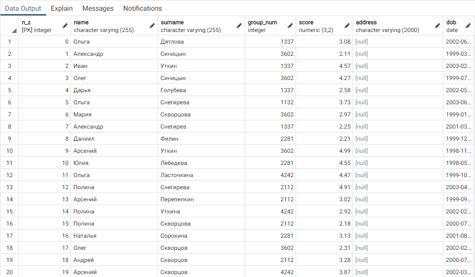
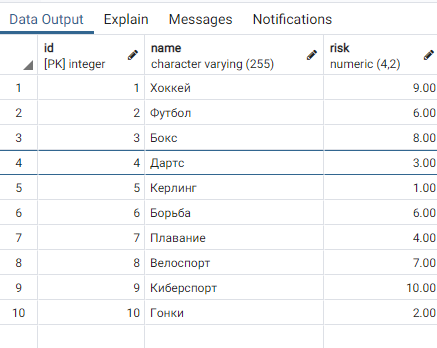
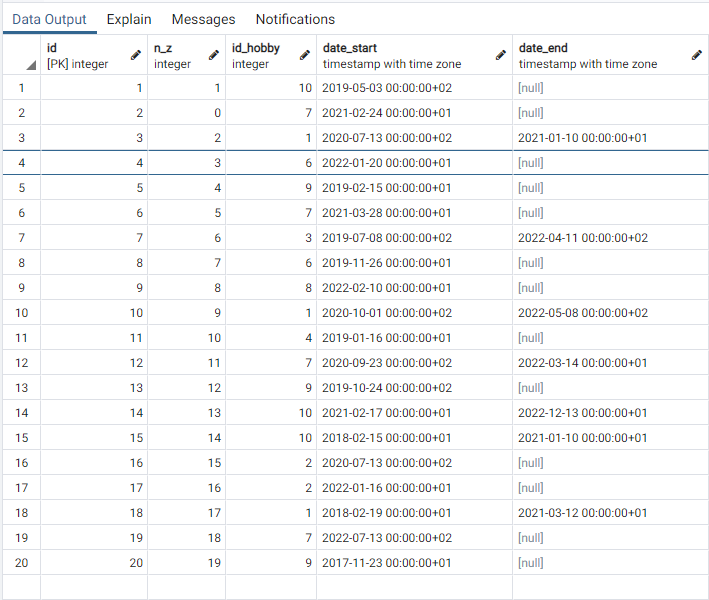

# Задание 1


# Создаем таблицы
## Студенты
Начинаем с создания таблицы для хранения студентов. Был использован данный запрос:

```SQL
CREATE TABLE "students" (
	"n_z" INTEGER NOT NULL,
	"name" VARCHAR(255) NOT NULL,
	"surname" VARCHAR(255) NULL DEFAULT NULL,
	"group_num" INTEGER NULL DEFAULT NULL,
	"score" NUMERIC(3,2) NULL DEFAULT NULL,
	"address" VARCHAR(2000) NULL DEFAULT NULL,
	"dob" DATE NULL DEFAULT NULL,
	PRIMARY KEY ("n_z"),
	CONSTRAINT "group_num" CHECK ((((group_num <= 9999) AND (group_num >= 1000)))),
	CONSTRAINT "score" CHECK ((((score >= (2)::numeric) AND (score <= (5)::numeric))))
);
```

## Хобби
Затем создаем таблицу с возможными хобби. Первичный ключ - идентификатор хобби.  

Используем следующий код для создания таблицы:
```SQL
CREATE TABLE "hobby" (
	"id" INTEGER NOT NULL ,
	"name" VARCHAR(255) NOT NULL,
	"risk" NUMERIC(4,2) NULL DEFAULT NULL,
	PRIMARY KEY ("id"),
	CONSTRAINT "risk" CHECK ((((risk >= (0)::numeric) AND (risk <= (10)::numeric))))
);
```
## Хобби студентов
Наконец, создаем таблицу, содержащую в себе связи между студентами и хобби, которыми они занимаются. Первичный ключ - идентификатор записи. Два внешних ключа - номер зачетки и ID хобби.


Используем следующий код для создания таблицы:
```SQL
CREATE TABLE "student_hobby" (
	"id" INTEGER NOT NULL ,
	"n_z" INTEGER NOT NULL,
	"id_hobby" INTEGER NOT NULL,
	"date_start" TIMESTAMPTZ NULL DEFAULT NULL,
	"date_end" TIMESTAMPTZ NULL DEFAULT NULL,
	PRIMARY KEY ("id"),
	CONSTRAINT "hobby_id" FOREIGN KEY ("id_hobby") REFERENCES "public"."hobby" ("id") ON UPDATE NO ACTION ON DELETE NO ACTION,
	CONSTRAINT "n_z" FOREIGN KEY ("n_z") REFERENCES "public"."students" ("n_z") ON UPDATE NO ACTION ON DELETE NO ACTION
)
```

# Заполняем таблицы
## Студенты
При помощи запроса приведенного ниже были добавленны студенты.В запроссе VALUES вместо звездочек был вписанны случайные именна фамилии и номера групп, а так же их бал и дата рождения. 
```SQL
INSERT INTO "students" (
    "n_z", 
    "name", 
    "surname", 
    "group_num", 
    "score", 
    "dob"
) 
VALUES 
    (*,*,*,*,*,*)
```


## Хобби
Для того, чтобы таблица с хобби содержала похожие на правду данные, ее необходимо заполнить вручную.  
Получаем следующую таблицу:  


## Сопоставление студентов с хобби
 Для вставки берется случайный студент и случайное хобби после чего с помощью SQL - запроса, приведенного ниже, данные добавляются в таблицу. Так как мы берем существующие ID студента и хобби, условия внешних ключей удовлетворяются.
```SQL
INSERT INTO "student_hobby" (
    "n_z", 
    "id_hobby", 
    "date_start", 
    "date_end"
) 
VALUES 
    (*,*,*,*)
```


