# Многотабличные запросы

# Запросы
## Вывести все имена и фамилии студентов, и название хобби, которым занимается этот студент
~~~sql
SELECT 
  st.name, st.surname, h.name 
FROM students st, student_hobby sth, hobby h 
WHERE 
  st.n_z = sth.n_z AND 
  sth.id_hobby = h.id AND 
  sth.date_end IS NULL

~~~
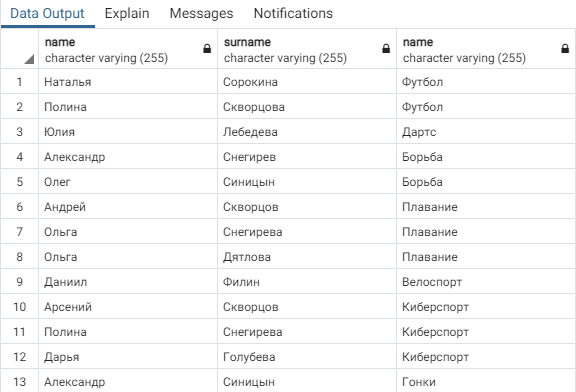

## Вывести информацию о студенте, занимающимся хобби самое продолжительное время
~~~sql
SELECT * FROM students st
WHERE st.n_z IN
	(SELECT st.n_z FROM
	 	(SELECT
		 sth.n_z,
		 sth.date_end - sth.date_start do_time
		 FROM student_hobby sth
		 WHERE
		 	sth.date_end - sth.date_start IS NOT NULL
		 ORDER BY do_time DESC
		 LIMIT 1) t
	 )
~~~
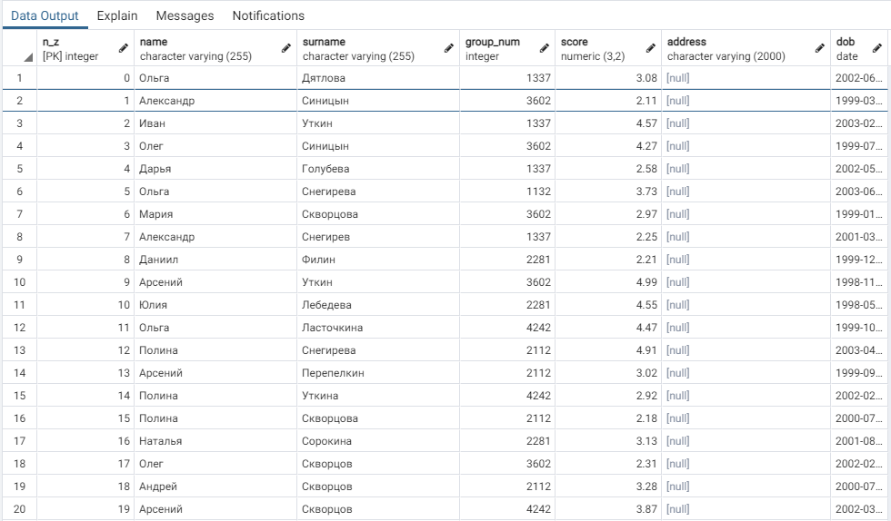

## Вывести имя, фамилию, номер зачетки и дату рождения для студентов, средний балл которых выше среднего, а сумма риска всех хобби, которыми он занимается в данный момент, больше 9.

~~~sql
SELECT st.n_z, st.name, st.surname, st.dob
FROM 
  students st,
  (SELECT sth.n_z, SUM(h.risk)
    FROM hobby h
    INNER JOIN student_hobby sth
    ON h.id = sth.id_hobby
    GROUP BY sth.n_z
    HAVING SUM(h.risk) > 9) hrisk
WHERE 
  st.score > (SELECT ROUND(AVG(st.score),2) FROM students st) AND
  hrisk.n_z = st.n_z
~~~
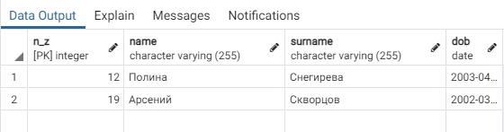

## Вывести фамилию, имя, зачетку, дату рождения, название хобби и длительность в месяцах, для всех завершенных хобби
~~~sql
SELECT st.n_z, st.name, st.surname, st.dob, h.name, sth.do_time FROM students st 
INNER JOIN 
  (SELECT 
    sth.n_z, 
    sth.id_hobby,
    sth.date_end - sth.date_start do_time 
  FROM student_hobby sth 
  WHERE sth.date_end - sth.date_start IS NOT NULL) sth 
ON st.n_z = sth.n_z 
INNER JOIN hobby h
ON sth.id_hobby = h.id
~~~
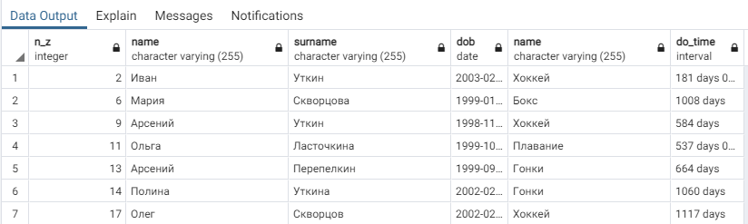

## Найти средний балл в каждой группе, учитывая только баллы студентов, которые имеют хотя бы одно действующее хобби.
~~~sql
SELECT st.group_num, ROUND(AVG(st.score),2)
FROM students st
INNER JOIN
  (SELECT *
    FROM student_hobby sth
    WHERE sth.date_end IS NULL) bruh
ON st.n_z = bruh.n_z
GROUP BY st.group_num
~~~
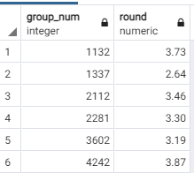

## Найти название, риск, длительность в месяцах самого продолжительного хобби из действующих, указав номер зачетки студента.
У меня таких значений не нашлось
~~~sql
SELECT h.name, h.risk, EXTRACT(MONTH FROM age(NOW(),sth.date_start))
FROM students st
INNER JOIN 
  (SELECT * FROM student_hobby sth
     WHERE sth.date_end IS NULL) sth
ON st.n_z = sth.n_z
INNER JOIN hobby h
ON sth.id_hobby = h.id
WHERE st.n_z = 2
ORDER BY DATE_PART DESC
LIMIT 1
~~~
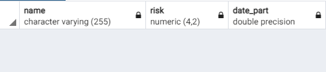

## Найти все хобби, которыми увлекаются студенты, имеющие максимальный балл.
```SQL
SELECT h.* FROM students st
INNER JOIN student_hobby sth
ON sth.n_z = st.n_z
INNER JOIN hobby h
ON sth.id_hobby = h.id
WHERE 
  st.score = (SELECT st.score
  FROM students st
  GROUP BY st.score
  ORDER BY st.score DESC
  LIMIT 1)
```
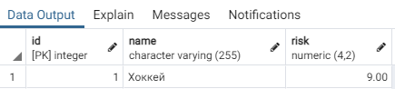  

## Найти все действующие хобби, которыми увлекаются троечники 2-го курса.
```SQL
SELECT h.name FROM students st
INNER JOIN student_hobby sth
ON sth.n_z = st.n_z
INNER JOIN hobby h
ON sth.id_hobby = h.id
WHERE 
  LEFT(st.group_num::VARCHAR, 1) = '2' AND 
  st.score >= 2.5 AND 
  st.score <= 3.5 AND
  sth.date_end IS NULL
```
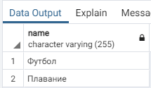  

## Вывести номера групп, в которых не менее 60% студентов имеют балл не ниже 4.
Таких значений в таблицах найдены не были
```SQL
SELECT sub.group_num
FROM
  (SELECT 
    st.group_num, 
    COUNT(st.n_z) total_count, 
    COUNT(st.score) FILTER (WHERE st.score > 4) above_score_count
  FROM students st
  GROUP BY st.group_num) sub
WHERE sub.total_count*0.6 < above_score_count
```
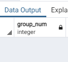  

## Для каждого курса подсчитать количество различных действующих хобби на курсе.
~~~sql
SELECT LEFT(st.group_num::VARCHAR,1) grade, COUNT(DISTINCT h.id)
FROM students st
INNER JOIN student_hobby sth
ON sth.n_z = st.n_z
INNER JOIN hobby h
ON sth.id_hobby = h.id
GROUP BY LEFT(st.group_num::VARCHAR,1)
~~~
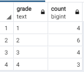  

## Вывести номер зачётки, фамилию и имя, дату рождения и номер курса для всех отличников, не имеющих хобби. Отсортировать данные по возрастанию в пределах курса по убыванию даты рождения.
~~~SQL
SELECT 
  st.n_z, 
  st.name, 
  st.surname, 
  st.date_of_birth, 
  LEFT(st.group_num::VARCHAR,1) grade
FROM students st
WHERE 
  st.score >= 4.5 AND
  st.n_z IN
    (SELECT sth.n_z
    FROM student_hobby sth
    GROUP BY sth.n_z
    HAVING COUNT(sth.date_end) = COUNT(sth.date_start))
ORDER BY
  LEFT(st.group_num::VARCHAR,1),
  st.date_of_birth DESC
~~~
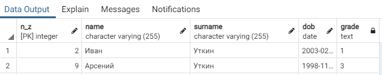  

# Создать представление, в котором отображается вся информация о студентах, которые продолжают заниматься хобби в данный момент и занимаются им как минимум 5 лет.

~~~SQL
CREATE OR REPLACE VIEW st_hobby_morethanyear AS
SELECT st.*
FROM students st
INNER JOIN student_hobby sth
ON sth.n_z = st.n_z
WHERE
  sth.date_end IS NULL AND
  EXTRACT(YEAR FROM AGE(NOW(),sth.date_start)) > 1
~~~
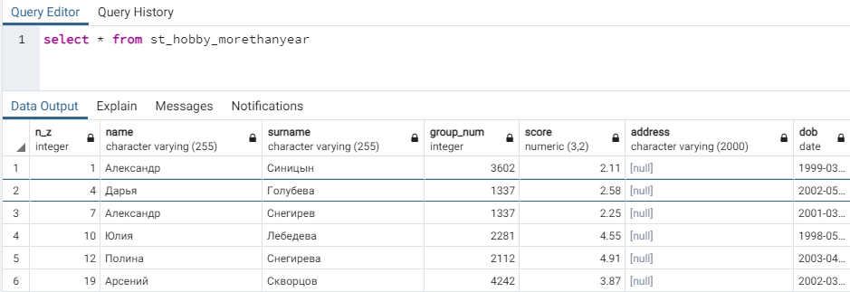  

## Для каждого хобби вывести количество людей, которые им занимаются.
~~~sql
SELECT h.name, COUNT(DISTINCT sth.n_z)
FROM hobby h
INNER JOIN student_hobby sth
ON h.id = sth.id_hobby
GROUP BY h.name
~~~
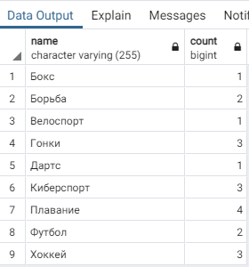  

## Вывести ID самого популярного хобби.
~~~sql
SELECT sth.id_hobby
FROM student_hobby sth
GROUP BY sth.id_hobby
ORDER BY COUNT(sth.n_z) DESC
LIMIT 1
~~~
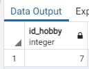 

## Вывести всю информацию о студентах, занимающихся самым популярным хобби.
~~~sql
SELECT st.*
FROM students st
INNER JOIN student_hobby sth
ON st.n_z = sth.n_z
WHERE
  sth.id_hobby = (SELECT sth.id_hobby
    FROM student_hobby sth
    GROUP BY sth.id_hobby
    ORDER BY COUNT(sth.n_z) DESC
    LIMIT 1) AND
  sth.date_end IS NULL
~~~
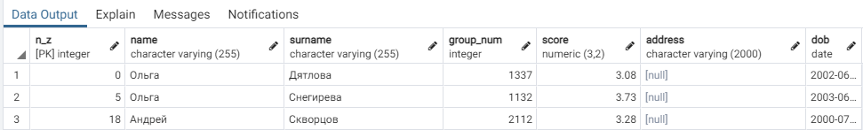 

## Вывести ID 3х хобби с максимальным риском
~~~sql
SELECT h.id
FROM hobby h
ORDER BY h.risk DESC
LIMIT 3
~~~
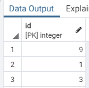 

## Вывести 10 студентов, которые занимаются одним (или несколькими) хобби самое продолжительно время.
~~~sql
SELECT *, AGE(COALESCE(date_end,NOW()),date_start) do_time
FROM students st
INNER JOIN student_hobby sth
ON st.n_z = sth.n_z
ORDER BY do_time DESC
LIMIT 10
~~~
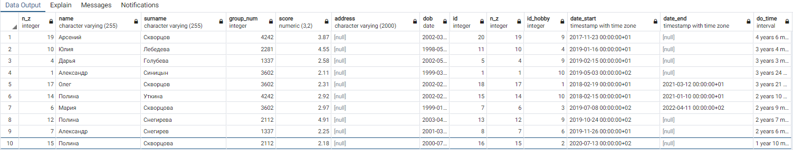 

## Вывести номера групп (без повторений), в которых учатся студенты из предыдущего запроса.
~~~sql
SELECT DISTINCT sss.group_num
FROM
  (SELECT *, AGE(COALESCE(date_end,NOW()),date_start) do_time
  FROM students st
  INNER JOIN student_hobby sth
  ON st.n_z = sth.n_z
  ORDER BY do_time DESC
  LIMIT 10) sss
~~~
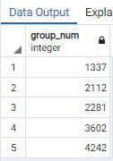 
## Создать представление, которое выводит номер зачетки, имя и фамилию студентов, отсортированных по убыванию среднего балла.
~~~sql
CREATE OR REPLACE VIEW st_orderby_score AS
SELECT st.n_z, st.name, st.surname
FROM students st
ORDER BY st.score DESC
~~~
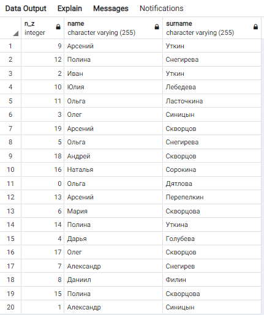 

