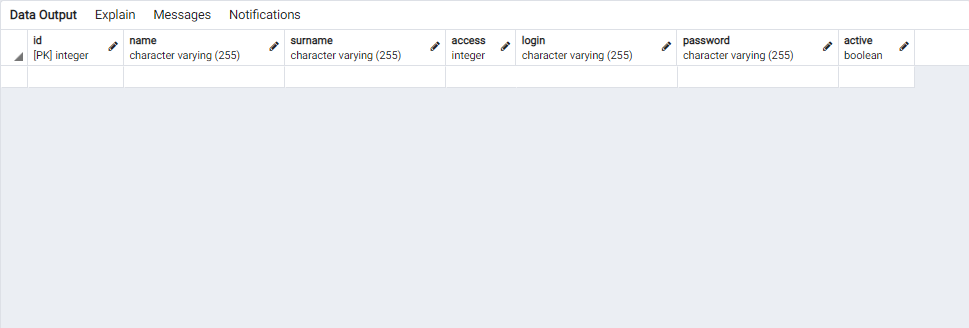
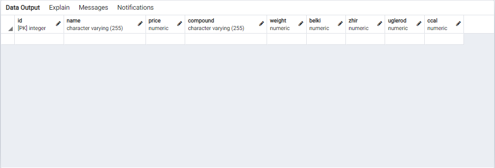
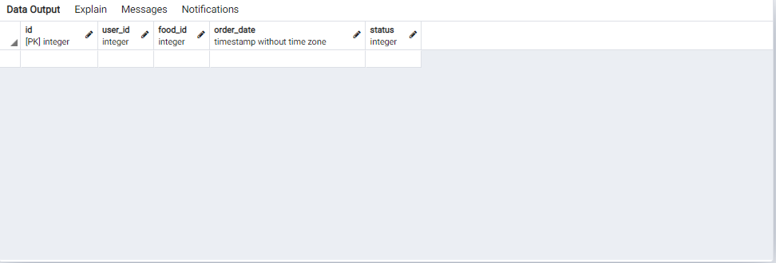

# Проект
##  Сервис удалённого заказа еды
### Запросы
1) Пользователь. Регистрация
2) Пользователь. Авторизация
3) Пользователь. Просмотр меню.
4) Пользователь. Добавление в корзину
5) Пользователь. Оформление заказа (Считаем, что оплата
производится «автоматом»)
6) Пользователь. Просмотр оформленных ранее заказов с пагинацией и
поиском по диапазону дат и блюд из меню, а также с сортировкой по
ценнику и дате
7) Пользователь. Возможность повторить (добавить в корзину) все
блюда из ранее оформленного заказа
8) Пользователь. Просмотр состояния заказа
9) Управляющий. Добавление новых позиций в меню (должен быть
указан состав, вес, белки, жиры, углеводы, ккал)
10) Управляющий. Видеть список заказов
11) Управляющий. Менять статус заказа
---------------------------------------------------------------------
## Создание таблиц
### Пользователи
~~~sql 
    CREATE TABLE  users(
	id serial PRIMARY KEY,
	name varchar(255) not null,
	surname varchar(255) not null,
	access int not null, 
    login varchar(255),
    password varchar(255),
    active boolean
);

CREATE sequence users_seq;
alter table users add
constraint access_CHECK
check (access >= 0 and access <= 1);
~~~

---------------------------------------------------------------------
### Еда
~~~sql
CREATE TABLE  food(
	
	id serial PRIMARY KEY,
	name varchar(255) not null,
    price decimal not null,
    compound varchar(255) not null,
	weight decimal not null,
	belki decimal,
	zhir decimal,
    uglevod decimal,
    ccal decimal not null
	
)
CREATE sequence food_seq;
~~~

---------------------------------------------------------------------
### Заказы
~~~sql
CREATE TABLE  orders(
	id serial PRIMARY KEY,
	user_id integer not null,
	food_id integer not null,
    order_date timestamp is not null,
	status int not null
);
CREATE sequence orders_seq;
alter table orders add
constraint status_CHECK
check (status >= 0 and status <= 3);
~~~

---------------------------------------------------------------------
### 1.Пользователь. Регистрация
Вместо звездочек вставляются некоторые данные.
```SQL
INSERT INTO users (name, surname, access, login, password, active)
VALUES (*, *, *, *, *, 0/1);
```
### 2. Пользователь. Авторизация
Вместо звездочек вносятся данные пользователя
```SQL
UPDATE users
SET active = true
WHERE login = * and password = *
```
### 3. Пользователь. Просмотр меню.
```SQL
SELECT name, price, compound, weight_gr, belki, zhir, uglevod, ccal
FROM food
```
### 4. Пользователь. Добавление в корзину
Вместо первых двух звездочек вносятся индетификаторы пользователя и еды.Вместо третьей звездочки вносится дата заказа.
```SQL
INSERT INTO orders (user_id, food_id, order_date, status)
VALUES (*, *, *, 0);
```
### 5. Пользователь. Оформление заказа (Считаем, что оплата производится «автоматом»)
Аналогично с предыдущим запросом.
```SQL
UPDATE orders 
SET status = 1
WHERE user_id = *, food_id = *, order_date = *
```
### 6. Пользователь. Просмотр оформленных ранее заказов с пагинацией и поиском по диапазону дат и блюд из меню, а также с сортировкой по ценнику и дате
```SQL
SELECT us.name, f.name, o.order_date
FROM orders o
INNER JOIN food f
ON f.id = o.food_id
INNER JOIN users us
ON us.id = o.user_id
WHERE status = 3 and (us.name = * or o.id = * or o.order_date = *)
ORDER BY f.price DESC, o.order_date DESC
LIMIT * OFFSET * 
```
### 7. Пользователь. Возможность повторить (добавить в корзину) все блюда из ранее оформленного заказа
~~~SQL
BEGIN 
	FOR food_id in
		SELECT food_id
		FROM orders o
		INNER JOIN food f
		ON f.id = o.food_id
		INNER JOIN users us
		ON us.id = o.user_id
		WHERE status = 3 and o.order_date = *
		ORDER BY f.price DESC, o.order_date DESC
	LOOP 
		INSERT INTO orders (user_id, food_id, order_date, status)
		VALUE (*, food_id, *, 0)
	END LOOP;
END;
~~~
### 8. Пользователь. Просмотр состояния заказа
```SQL
SELECT food_id, order_date, status
FROM orders
WHERE user_id = $1 and order_date = $2
```
---------------------------------------------------------------------
## Управляющий
### 9. Управляющий. Добавление новых позиций в меню (должен быть указан состав, вес, белки, жиры, углеводы, ккал)
```SQL
INSERT INTO food (name, price, compound, weight_gr, belki, zhir, uglevod, ccal)
VALUES (*, *, *, *, *, *, *, *);
```
### 10. Управляющий. Видеть список заказов
```SQL
SELECT user_id, food_id, order_date, status
FROM orders
WHERE status = * 
```
### 11. Управляющий. Менять статус заказа
```SQL
UPDATE orders
SET status = $1
WHERE id = * or user_id = * or order_date = *, food_id = *, status = *;
```