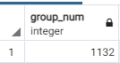

# Групповые функции


## Выведите на экран номера групп и количество студентов, обучающихся в них
  
`GROUP BY ...` определяет колонку, по которой группируются атрибуты.  
`COUNT(...)` производит заданную операцию над сгруппированными данными, в данном случае - подсчет количества строк.  
```SQL
SELECT st.group_num, COUNT(st.n_z) FROM students st GROUP BY st.group_num
```
  
 

## Выведите на экран для каждой группы максимальный средний балл 
Используем групповую функцию `MAX(...)` для выбора максимального значения атрибута в группе.  
```SQL
SELECT st.group_num, MAX(st.score) FROM students st GROUP BY st.group_num
```
  


## Подсчитать количество студентов с каждой фамилией 
```SQL
SELECT st.surname, COUNT(st.surname) FROM students st GROUP BY st.surname
```
  


## Подсчитать студентов, которые родились в каждом году 
`EXTRACT(... FROM ...)` позволяет получить некое определенное поле из даты.  
```SQL
SELECT 
  EXTRACT(YEAR FROM st.dob), 
  COUNT(EXTRACT(YEAR FROM st.dob)) 
FROM students st 
GROUP BY 
  EXTRACT(YEAR FROM st.dob)
```
  
 

## Для студентов каждого курса подсчитать средний балл

```SQL
SELECT 
  LEFT(st.group_num::VARCHAR,1) grade, 
  ROUND(AVG(st.score),2) score 
FROM students st 
GROUP BY 
  LEFT(st.group_num::VARCHAR,1)
```
  


## Для студентов заданного курса вывести один номер группы с максимальным средним баллом 
```SQL
SELECT st.group_num 
FROM students st
WHERE
  LEFT(st.group_num::VARCHAR,1) = '1'
GROUP BY
  st.group_num
ORDER BY 
  AVG(st.score) DESC
LIMIT 1
```
  


## Для каждой группы подсчитать средний балл, вывести на экран только те номера групп и их средний балл, в которых он менее или равен 3.5. Отсортировать по от меньшего среднего балла к большему.  
`HAVING` похож на `WHERE`, но используется для групповых функций.  
```SQL
SELECT st.group_num, ROUND(AVG(st.score),2) score
FROM students st
GROUP BY
  st.group_num
HAVING
  AVG(st.score) > 3.5
ORDER BY 
  AVG(st.score)
```
  


## Для каждой группы в одном запросе вывести количество студентов, максимальный балл в группе, средний балл в группе, минимальный балл в группе
 
```SQL
SELECT 
  st.group_num,
  COUNT(st.n_z) student_count,
  MAX(st.score),
  ROUND(AVG(st.score),2),
  MIN(st.score)
FROM students st
GROUP BY
  st.group_num
```
  
*Результат*  

## Вывести студента/ов, который/ые имеют наибольший балл в заданной группе
 
```SQL
SELECT st.*
FROM 
  (SELECT * FROM 
    (SELECT st.group_num, MAX(st.score) FROM students st GROUP BY st.group_num) gr_max
  WHERE gr_max.group_num = '2281') temp_res,
  students st
WHERE
  temp_res.group_num = st.group_num AND temp_res.max = st.score
```
  
  

## Аналогично предыдущему заданию, но вывести в одном запросе для каждой группы студента с максимальным баллом.
```SQL
SELECT st.*
FROM 
  (SELECT st.group_num, MAX(st.score) FROM students st GROUP BY st.group_num) gr_max,
  students st
WHERE
  gr_max.group_num = st.group_num AND gr_max.max = st.score
```
  
 